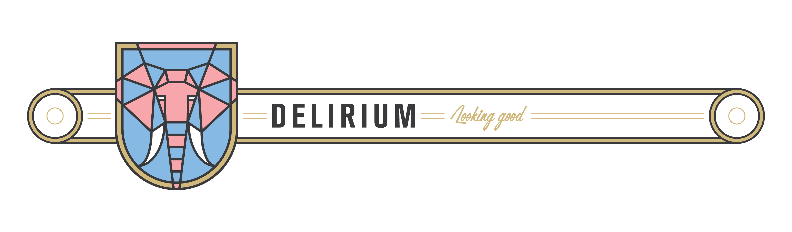
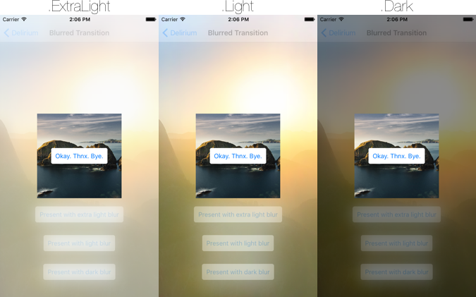
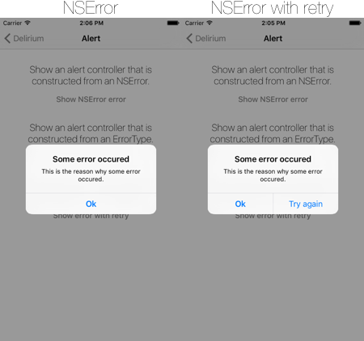
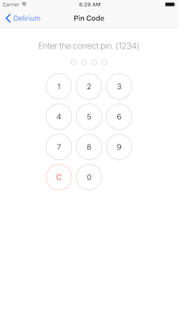
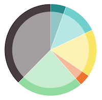

[](https://travis-ci.org/icapps/ios-delirium)
[](http://cocoapods.org/pods/Delirium)
[](http://cocoapods.org/pods/Delirium)
[](http://cocoapods.org/pods/Delirium)
[](https://swift.org)

> Delirium contains a set of UI components that can be reused during development.

## TOC

- [Installation](#installation)
- [Features](#features)
  - [Animations](#animations)
    - [Blurred Transition](#blurred-transition)
    - [Shake](#shake)
  - [Controllers](#controllers)
    - [Alert](#alert)
    - [Pin](#pin)
  - [Views](#views)
    - [Pie Chart](#pie-chart)
- [Bucket List](#bucket-list)
- [Author](#author)
- [License](#license)

## Installation

Delirium is available through [CocoaPods](http://cocoapods.org). To install it, simply add the following line to your `Podfile`:

```ruby
pod 'Delirium', '~> 0.5'
```

## Features

### Animations

#### Blurred Transition

Add some custom modal transitions to your application. Here is an example of what this transition looks like:



You can pass all the values of `UIBlurEffectStyle` to the `ActionTransitioningDelegate` class. And here is how you implement this transition.

```swift
let transitionDelegate = ActionTransitioningDelegate()

required init?(coder aDecoder: NSCoder) {
  super.init(coder: aDecoder)

  transitionDelegate.blurEffectStyle = .Light
  transitioningDelegate = transitionDelegate
  modalPresentationStyle = .Custom
}
```

_This transition will only work on iOS 9._

#### Shake

You can shake a UIView with this handy `shake` function.

```swift
let view: UIView = ...

// Shake the view with the default `duration` of 0.07 seconds and a `repeatCount` of 4.
view.shake()

// You can also pass a custom `duration` or `repeatCount` is wanted.
view.shake(repeatCount: 10, duration: 1.0)
```

## Controllers

### Alert

You can present an `NSError` from your `UIViewController` instance. This will present a `UIAlertController` with a title translated by the 'delirium.alert.button.ok' key. And with a description `localizedDescription` from `NSError`.

Here is an example of how it looks:



And here how to implement:

```swift
let error: NSError = ...
presentAlertController(withError: error)
```

When you want to present an 'ErrorType' than you'll have to conform to the `AlertError` protocol. This will make sure that the `ErrorType` has a title and a description to show in the alert.

```swift
struct SomeError: AlertError {
  var title: String { return "Some error occured" }
  var description: String { return "This is the reason why some error occured." }
}

let error: SomeError = ...
presentAlertController(withError: error)
```

All the `presentAlertController` function can have a `retry` closure. When implementing this closure you will get a 'Try again' button in the alert. When tapping this button the closure will be triggered.

```swift
let error: NSError = ...
presentAlertController(withError: error) {
  // Tapped retry.
}
```

### Pin

Present a pin view controller is really easy with _Delirium_.



```swift
let controller = pinViewController()
controller.delegate = self
navigationController?.pushViewController(controller, animated: true)
```

When you set the delegate to be the current controller. Than this controller needs to conform to `PinViewControllerDelegate`. Which means that the following method should be implemented.

```swift
func pinViewController(controller: PinViewController, didEnterPin pin: String) {
    // This method is called whenever your pin code is complete.
    // So when the `numberOfDigitis` matched the pin count.
}
```

You can pass a custom configuration to the `PinViewController`. Here are some of the options that can be configured:

```swift
let configuration = PinConfiguration()

// Define the number of digits you want to enter.
configuration.numberOfDigits = 4
// The title to be displayed in the navigation bar.
configuration.title = "Enter your pin"
// The color of the filled dot at the top of the pin view.
configuration.dotColor = UIColor(red:0.11, green:0.68, blue:0.93, alpha:1.00)
// The color of the stroked dot at the top of the pin view.
configuration.dotStrokeColor = UIColor(red:0.73, green:0.77, blue:0.81, alpha:1.00)
// The color of the stroked pin number button.
configuration.numberStrokeColor = UIColor(red:0.75, green:0.79, blue:0.83, alpha:1.00)
// The color of the highlighted background in the pin number button.
configuration.selectionBackgroundColor = UIColor(red:0.90, green:0.91, blue:0.93, alpha:1.00)
// The color of the background in the pin number button.
configuration.backgroundColor = UIColor.whiteColor()
// The color of the text in the pin number button.
configuration.numberTextColor = UIColor(red:0.01, green:0.13, blue:0.28, alpha:1.00)
```

You can set the configuration by passing the `configuration` instance to the `pinViewController()` method.

```swift
let configuration = PinConfiguration()
let controller = pinViewController(withConfiguration: configuration)
```

## Views

### Pie Chart

Show a basic pie chart that has a simple overlay that breaks the pie chart and gives it a clean design.



You can easily integrate the `PieChartView` by just extending a `UIView` in your storyboard. But for the hardcore fans, you can also create the view manually. (_like an animal_)

When the view is created you can add some slices to it. A slice contains a value and a color.

```swift
let pieChartView = ...

pieChartView.add(slice: PieChartSlice(value: 12.0, color: UIColor.redColor()))
pieChartView.add(slice: PieChartSlice(value: 8.0, color: UIColor.greenColor()))
```

This will result in a pie chart that has two slices. The **red** slice will take 60% of the pie chart, and the **green** slice will contain 40% of the pie chart.

Next to the slices you can also pass some minor configuration options to the view.

```swift
// This is the overlay color of the circle that is drawn over the center of the pie chart. When giving this color an alpha value the pie chart is broken nicely.
pieChartView.overlayColor = UIColor.blueColor()

// This stroke color is the color that is displayed between the slices.
pieChartView.strokeColor = UIColor.blueColor()

// This is the size of the padding from where the overlay circle will be displayed.
pieChartView.overlayPadding = 20.0
```

## Bucket List

Here is an overview what is on our todo list.

- [ ] Add `UIView` Wiggle.

## Author

Jelle Vandebeeck, jelle@fousa.be

## License

Delirium is available under the MIT license. See the LICENSE file for more info.
